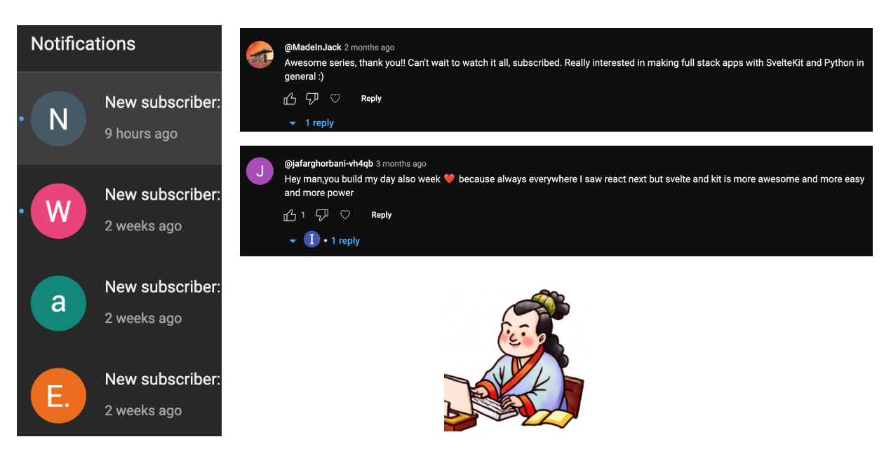
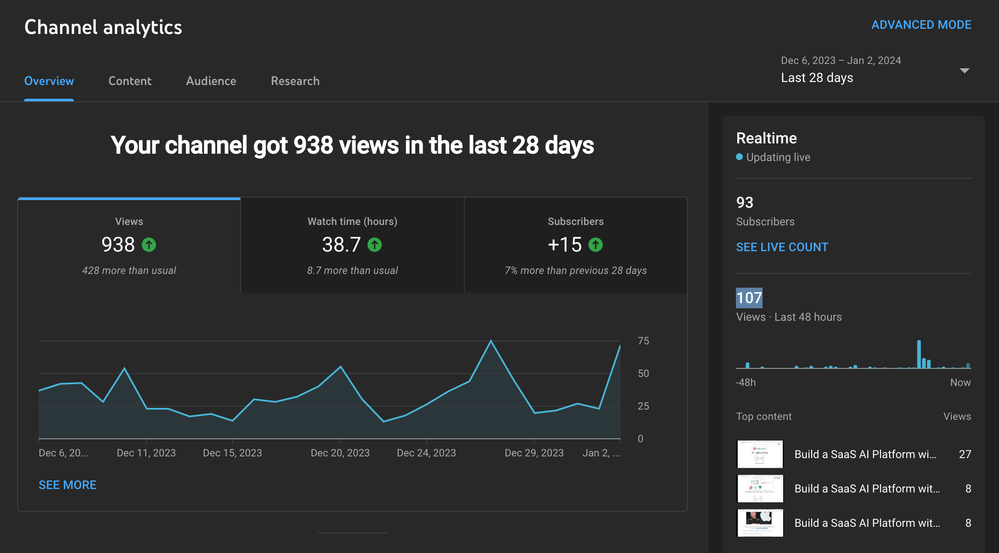
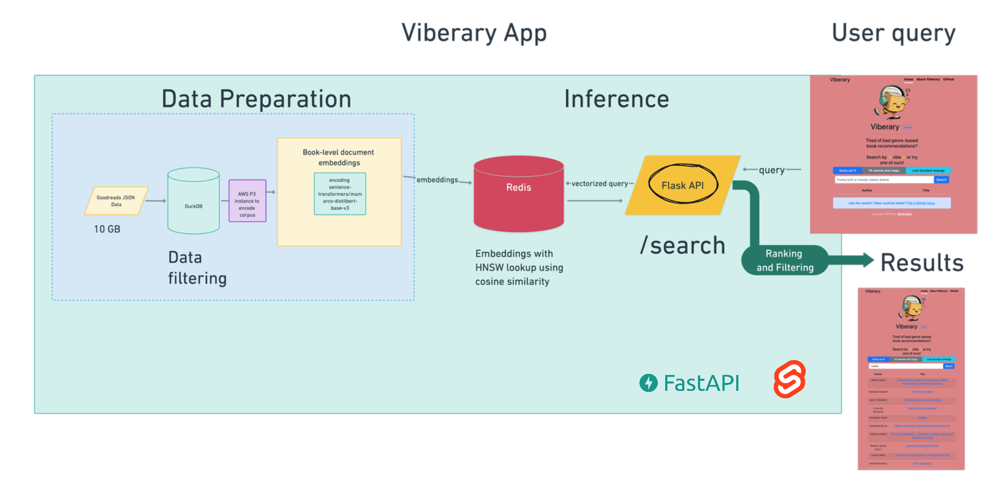
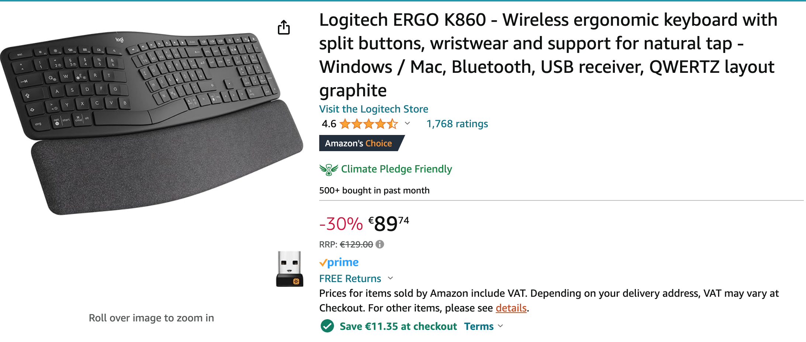

# Rapid AI Development with SvelteKit & FastAPI: Unleash Lightning-Fast Applications!

Fei Wang (Michael) :heart: AI

HyperGI

Github: [oceanumeric](https://github.com/oceanumeric)

--- 

# Motivated by the community

> Awesome series, thank you!! Can't wait to watch it all, subscribed. Really interested in making full stack apps with SvelteKit and Python in general :) --- @MadeInJack

 

> Hey man,you build my day also week ❤ because always everywhere I saw react next but svelte and kit is more awesome and more easy and more power -- @jafarghorbani-vh4qb

---

# Why do another recordings?

- The first version is not very organized
- The first version did not talk about `FastAPI` that much 
- Now we will try to make it more organized and more complete

> hey nice job on such an awesome course if possible please do more such course but in a single video with different sections and also try other stack as well but with svelte as main front end framework. for  eg:- database through supabase,..

---

---

---

# End Product

<a href="https://staging.viberary.pizza/" target="_blank"> Viberary</a> from Vicki Boykis (@mozilla-ai)
    - but we will use `FastAPI` instead of `Flask` for backend
    - we will use `SvelteKit` instead of `Flask` for frontend
    - Explore `PostgreSQL` and `Clickhouse` for database
    - Learn how to use `duckdb` for data science
    - Practice cloud deployment with `AWS` and `Digital Ocean`
    - many more ...

---

---
# Roadmap:

- with my new keyboard [Logitech Ergo K860], I can type faster and more comfortable
- Project-driven learning
    - project 1: client-side vs server-side rendering
        - `SvelteKit` vs `FastAPI`
    - project 2: Routing and Loading Data
        - `SvelteKit`
        - API design with `FastAPI`
    - Project 3: Form Actions  and Components
    - Project 4: Big Data Analytics with `duckdb` and `data.table`
    - Project 5: Sentence Embedding with `sentence-transformers`
    - Project 6: Database Design with `PostgreSQL`, `Clickhouse` and `Redis`
    - 3 more projects ...

---

# Roadmap:

The whole course will be divided into 3 parts:

- Section I: project 1 - 3

- Section II: project 4 - 6

- Section III: project 7 - 9

---

# Happy Coding!

---

# Before we start, bulk up with a new keyboard

