# Project 4: Big Data Analytics in the era of AI

Fei Wang (Michael) :heart: AI

HyperGI

Github: [oceanumeric](https://github.com/oceanumeric)


---

# What we have learned so far

- Frontend
    - Server-side rendering and client-side rendering
    - Sveltekit and FastAPI
    - Sveltekit Form Actions


--- 

# What we will cover in the future

- Section II: Backend
    - data preprocessing
    - understanding the data
    - tran an ML model

- Section III: Connecting frontend and backend
    - API
    - Deploying the app to the cloud


---

# You will learn a lot in the end of this course :high_brightness:


--- 

# Our goal: semantic search based on content rather than keywords

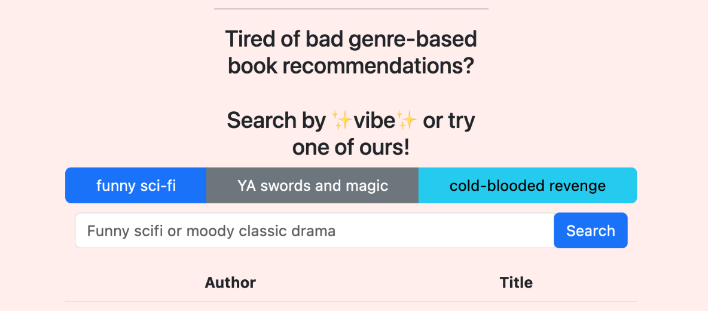

---

# Our dataset: Goodreads Book Graph Datasets

- <a href="https://mengtingwan.github.io/data/goodreads.html" target="_blank"> Goodreads Book Graph Datasets</a>
- <a href="https://www.goodreads.com/book/show/14318.Chronicles_Volume_One" target="_blank"> Goodreads Example</a>

- Total size: + 10GB (compressed); + 50GB (uncompressed)
- Number of books: 2.36M
- It can be called a big data project


---

# Data Engineering 101: the core

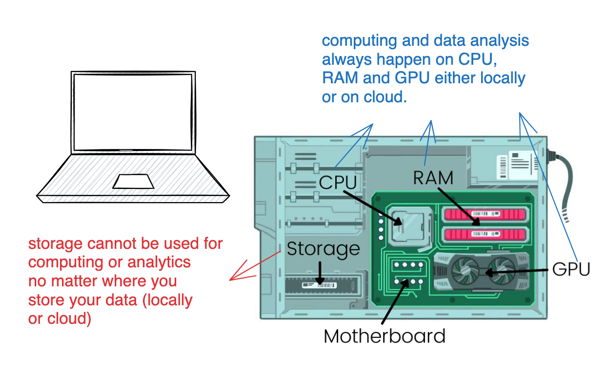


---

# Data Engineering 101: the core

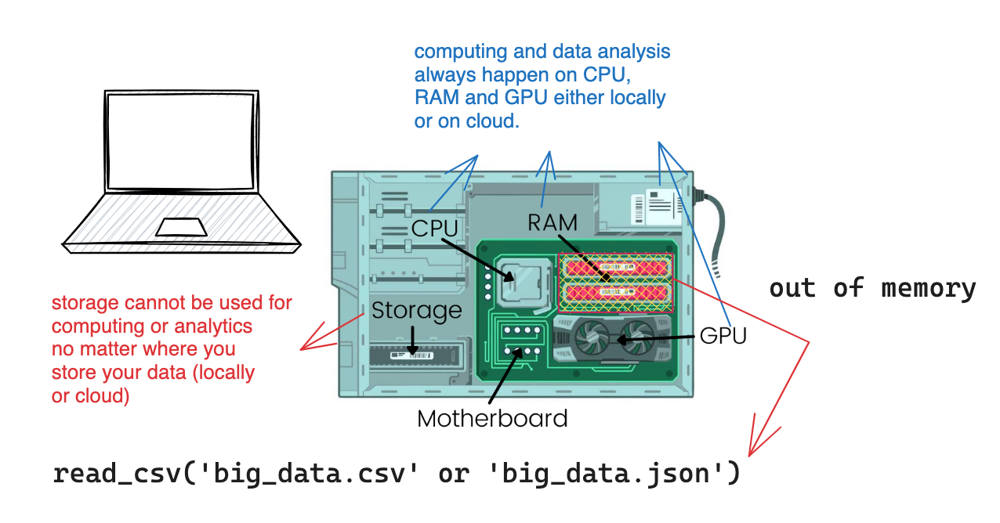


---

# Data Engineering 101: modern data stack


---

# Data Engineering 101: modern data stack


---

# Data Engineering 101: too many tools

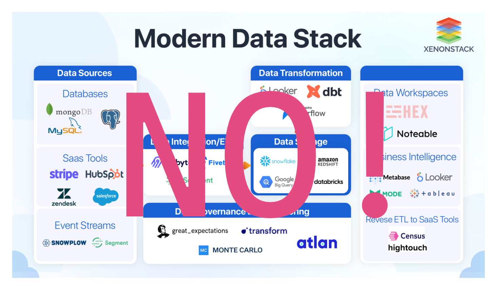


---

# How to navigate the modern data stack?

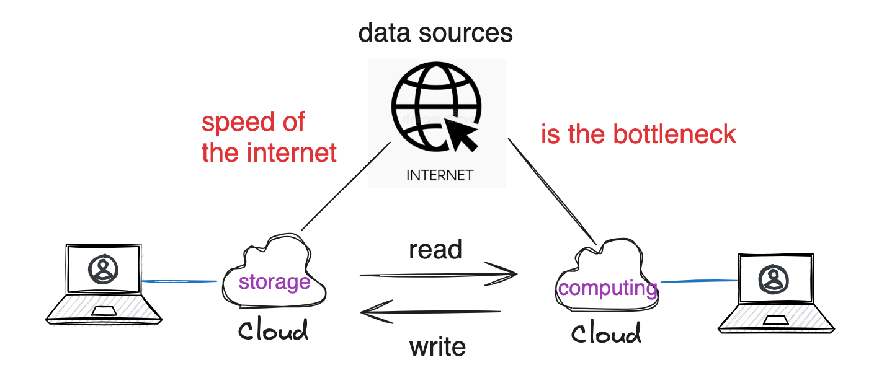


---


---

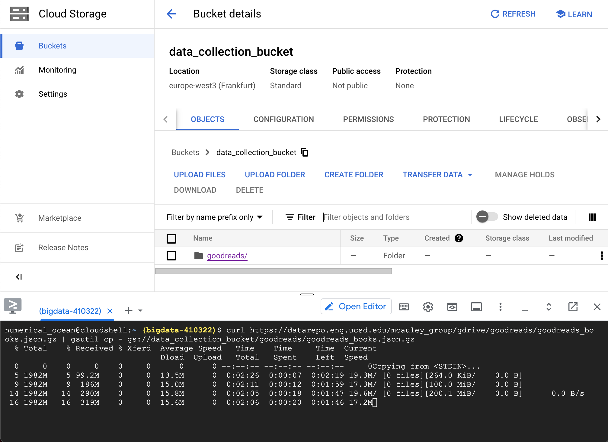


---

# Navigate the modern data stack

- You cannot speed up the data flow if you have to move the data from one tool to another
    - especially when the data is big
    - and it has to travel through the internet
- The top rule is to use less tools
    - with one more tool,
        - you have to learn it
        - you have to move the data to it


---

# Navigate the modern data stack

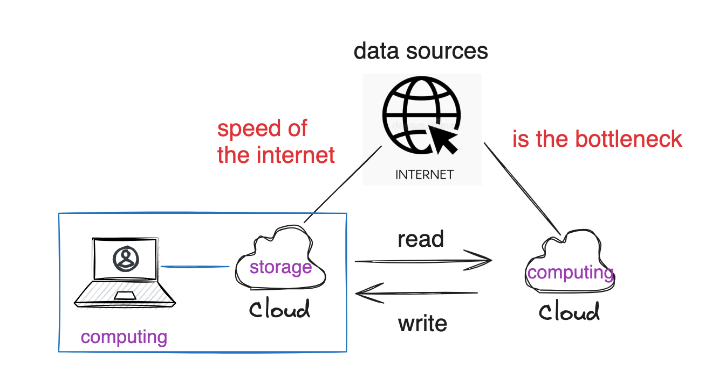


---

# Navigate the modern data stack

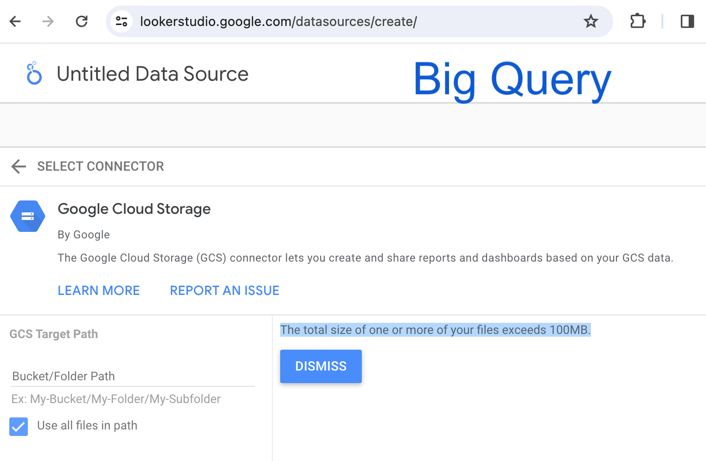


---


---

# Roadmap

- Introduction to big data analytics

- Download the data from Google Cloud Storage and `bash` scripting

- Data preprocessing with `duckdb` in R or Python

- Data analysis with `duckdb` in R or Python


---

# Introduction to big data analytics :elephant:


---

# Big data analytics in the era of AI: benchmark

- <a href="https://duckdblabs.github.io/db-benchmark/" target="_blank"> Benchmark </a>
- Guidances:
    - CSV (<= 50 GB): `data.table` in R
    - CSV (>= 50 GB): `duckdb` in R or Python
    - Json (>= 5 GB): `duckdb` in R or Python
    - Parquet (>= 5 GB): `duckdb` in R or Python
- Therefore, you only need to know:
    - `data.table` in R
    - `pandas` in Python
    - `duckdb` in R or Python (SQL)


---


---

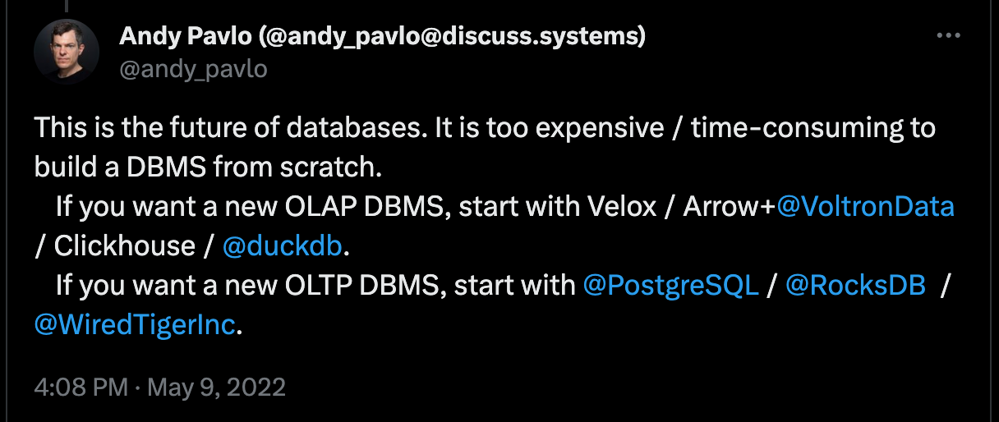


---

# DuckDB: a new tool with old SQL

- <a href="https://duckdb.org/" target="_blank"> DuckDB </a>
- Big data analytics
- SQL
- library in R and Python
- <a href="https://vickiboykis.com/2022/12/05/the-cloudy-layers-of-modern-day-programming/" target="_blank"> The Cloudy Layers of Modern-Day Programming </a>
- <a href="https://vickiboykis.com/2023/01/17/welcome-to-the-jungle-we-got-fun-and-frames/" target="_blank"> Welcome to the Jungle, We Got Fun and Frames </a>


---
##  DuckDB: a new tool

- <a href="https://speakerdeck.com/higgi13425/big-data-with-arrow-and-duckdb?slide=6" target="_blank"> Big Data with Arrow and DuckDB </a>
- <a href="https://bwlewis.github.io/duckdb_and_r/taxi/taxi.html" target="_blank"> DuckDB and R </a>


---

## DuckDB: a new tool

<a href="https://colorado.posit.co/rsc/bigger-data-prez/#12" target="_blank"> Bigger Data </a>

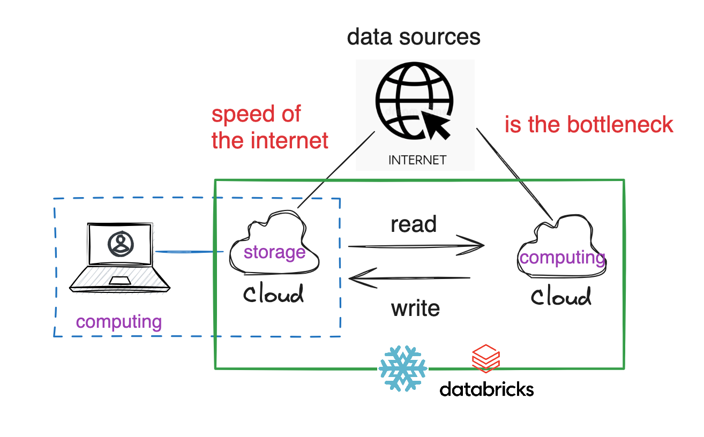


---

# We did not talk about GPU based data analytics :seedling:


--- 

# Install DuckDB in Ptthon or R

```python
pip install duckdb  # python
```


```r
install.packages("duckdb")  # R
```

```bash
# you can also install it in bash
# but i don't know why I could not manage to install it for
# ubuntu 20.04 x86_64
# with command line installed, you can do this
duckdb --version
duckdb
# and then run sql directly
select 42;
```


---

# Make sure you have alread downloaded the data :dart:

- have enough RAM (>= 16GB)
- have enough disk space (>= 50GB)


---

# Benchmark :racehorse:

- compare `pandas` and `duckdb` in Python
- I created a scripe file called `duckdb_profile.py`
- benchmark two dimensions:
    - time
    - memory usage
- Input data: `goodreads_books.json.gz` (1.94 GB, around 8-9 GB uncompressed)


---

# Benchmark :panda_face:

```python
import os
import time
import duckdb
import pandas as pd
from dotenv import load_dotenv
from memory_profiler import profile

if __name__ == "__main__":
    start = time.time() 
    df = pd.read_json("./data/goodreads_books.json.gz", lines=True)
    end = time.time()
    print(end - start)  # computer crashed 💥
    # WARNING: do not use pandas to read a large json file
```

---

# Benchmark :duck:

```python
@profile
def read_json():
    start = time.time()
    duckdb.read_json("./data/goodreads_books.json.gz").show()
    end = time.time()
    print(end - start)  

if __name__ == "__main__":
    read_json()  # 6 seconds for 1.94 GB data
```


---

# Benchmark :duck:

```bash
$ python duckdb_profile.py
6.171117067337036
Filename: /home/michael/Github/semantic-search/goodreads/duckdb_profile.py
Line #    Mem usage    Increment  Occurrences   Line Contents
=============================================================
    14    106.7 MiB    106.7 MiB           1   @profile
    15                                         def read_json():
    16    106.7 MiB      0.0 MiB           1       start = time.time()
    17   1231.2 MiB   1124.5 MiB           1       duckdb.read_json("./data/goodreads_books.json.gz").show()
    18   1231.2 MiB      0.0 MiB           1       end = time.time()
    19   1231.2 MiB      0.0 MiB           1       print(end - start)  # 6 seconds 
```


---


---

# Benchmark :duck:

```bash
┌────────────┬───┬──────────────────────┬──────────────────────┐
│    isbn    │ … │        title         │ title_without_series │
│  varchar   │   │       varchar        │       varchar        │
├────────────┼───┼──────────────────────┼──────────────────────┤
│ 0312853122 │ … │ W.C. Fields: A Lif…  │ W.C. Fields: A Lif…  │
│ 0743509986 │ … │ Good Harbor          │ Good Harbor          │
│            │ … │ The Unschooled Wiz…  │ The Unschooled Wiz…  │
│ 0743294297 │ … │ Best Friends Forever │ Best Friends Forever │
│ 0850308712 │ … │ Runic Astrology: S…  │ Runic Astrology: S…  │
│ 1599150603 │ … │ The Aeneid for Boy…  │ The Aeneid for Boy…  │
│ 0425040887 │ … │ The Wanting of Lev…  │ The Wanting of Lev…  │
│ 1934876569 │ … │ All's Fairy in Lov…  │ All's Fairy in Lov…  │
│            │ … │ Playmaker: A Venom…  │ Playmaker: A Venom…  │
│ 0922915113 │ … │ The Devil's Notebook │ The Devil's Notebook │
│     ·      │ · │          ·           │          ·           │
│     ·      │ · │          ·           │          ·           │
│     ·      │ · │          ·           │          ·           │
│ 8498381436 │ … │ Harry Potter y las…  │ Harry Potter y las…  │
│ 9188877663 │ … │ Harry Potter och d…  │ Harry Potter och d…  │
│ 9789671118 │ … │ Memoir Bukan Memoir  │ Memoir Bukan Memoir  │
│            │ … │ Den bittra pajens …  │ Den bittra pajens …  │
│ 0957142013 │ … │ Shadows              │ Shadows              │
│ 0810127393 │ … │ My Journey: How On…  │ My Journey: How On…  │
│            │ … │ Martin Arrowsmith    │ Martin Arrowsmith    │
│ 161372280X │ … │ The Boy Behind the…  │ The Boy Behind the…  │
│ 1611561310 │ … │ The Portal           │ The Portal           │
│            │ … │ Quero crescer!       │ Quero crescer!       │
├────────────┴───┴──────────────────────┴──────────────────────┤
│ ? rows (>9999 rows, 20 shown)           29 columns (3 shown) │
└──────────────────────────────────────────────────────────────┘

6.171117067337036
```

---

# Benchmark :duck:

```python
@profile
def read_cloud_file():
    db = duckdb.connect()
    start = time.time()
    # install httpfs
    db.sql(f"""
           INSTALL httpfs;
           LOAD httpfs;
           SET s3_endpoint = 'storage.googleapis.com';
           SET s3_access_key_id = '{google_storage_key}';
           SET s3_secret_access_key = '{google_storage_secret}';
           """)
    db.sql("""
           select * from read_json_auto('s3://data_collection_bucket/goodreads/goodreads_books.json.gz');
           """).show()
    end = time.time()
    print(end - start)  # 50 seconds
```


---

# A good article about :duck:

<a href="https://arrow.apache.org/blog/2021/12/03/arrow-duckdb/" target="_blank"> Arrow and DuckDB </a>

---

# Dive into the data :swimmer:

- Two datasets:
    - `goodreads_books.json.gz` (1.94 GB, around 8-9 GB uncompressed)
    - `goodreads_reviews_dedup.json.gz` (4.98 GB, around 20-30 GB uncompressed)

- we need to:
    - understand the data
    - link the data
    - create a new dataset


---

# Book dataset

- 2.36M books
- 29 columns, such as author, title, description, etc.


```bash
┌──────────────────────┬────────────────────────────────────────────┬──────┬──────┬─────────┬───────┐
│     column_name      │                column_type                 │ null │ key  │ default │ extra │
├──────────────────────┼────────────────────────────────────────────┼──────┼──────┼─────────┼───────┤
│         isbn         │                  VARCHAR                   │ YES  │ None │   None  │  None │
│  text_reviews_count  │                  VARCHAR                   │ YES  │ None │   None  │  None │
│     country_code     │                  VARCHAR                   │ YES  │ None │   None  │  None │
│    language_code     │                  VARCHAR                   │ YES  │ None │   None  │  None │
│   popular_shelves    │   STRUCT(count BIGINT, "name" VARCHAR)[]   │ YES  │ None │   None  │  None │
│      ........        │                     ...                    │ ...  │ ...  │   ...   │  ...  │
│         asin         │                  VARCHAR                   │ YES  │ None │   None  │  None │
│         url          │                  VARCHAR                   │ YES  │ None │   None  │  None │
│       book_id        │                   BIGINT                   │ YES  │ None │   None  │  None │
│    ratings_count     │                  VARCHAR                   │ YES  │ None │   None  │  None │
│       work_id        │                  VARCHAR                   │ YES  │ None │   None  │  None │
│        title         │                  VARCHAR                   │ YES  │ None │   None  │  None │
└──────────────────────┴────────────────────────────────────────────┴──────┴──────┴─────────┴───────┘
```

--- 

# Columns of interest

- Books dataset: `country_code` (for keyword search), `language_code` (for keyword search), `average_rating` (for display), `authors` (for display), ratings_count` (for display), `url` (for frontend)
    - `book_id`
    - `title`  (for embedding and search) 
    - `description` (for embedding and search),

- Reviews dataset
    - `book_id`
    - `user_id`
    - `review_text` (for embedding and search)


--- 

# Reviews dataset

- 15.7m reviews
- 11 columns, such as book_id, user_id, review_text, etc.

```bash
┌──────────────┬─────────────┬──────┬──────┬─────────┬───────┐
│ column_name  │ column_type │ null │ key  │ default │ extra │
├──────────────┼─────────────┼──────┼──────┼─────────┼───────┤
│   user_id    │     UUID    │ YES  │ None │   None  │  None │
│   book_id    │    BIGINT   │ YES  │ None │   None  │  None │
│  review_id   │     UUID    │ YES  │ None │   None  │  None │
│    rating    │    BIGINT   │ YES  │ None │   None  │  None │
│ review_text  │   VARCHAR   │ YES  │ None │   None  │  None │
│  date_added  │   VARCHAR   │ YES  │ None │   None  │  None │
│ date_updated │   VARCHAR   │ YES  │ None │   None  │  None │
│   read_at    │   VARCHAR   │ YES  │ None │   None  │  None │
│  started_at  │   VARCHAR   │ YES  │ None │   None  │  None │
│   n_votes    │    BIGINT   │ YES  │ None │   None  │  None │
│  n_comments  │    BIGINT   │ YES  │ None │   None  │  None │
└──────────────┴─────────────┴──────┴──────┴─────────┴───────┘
```


---

# Summary Statistics :bar_chart:

- Some handy tools:
    - Jupyter Notebook
    - <a href="https://github.com/ploomber/jupysql" target="_blank"> JupyterSQL </a>
        - `%sql` for one line SQL
        - `%%sql` for multiple lines SQL
        - do not put `#` in the SQL query
- Best Practices:
    - Use scripy for production
    - Use Jupyter Notebook for exploration


---

```python
%load_ext sql
conn = duckdb.connect()
%sql conn --alias duckdb

# to receive feedback from SQL queries
%config SqlMagic.feedback = False
%config SqlMagic.displaylimit = None  # None means unlimited
%config SqlMagic.style = "SINGLE_BORDER" 

# some people like to use this
# %config SqlMagic.autopandas = True
# but this will make the notebook slow
```

```python
%%sql column_info <<
describe
select * from read_json_auto('./data/goodreads_books.json.gz')
```

```python
print(column_info)
```

---

```python
# this will not work as %%sql has to be the first line
%%sql column_info <<
describe
select * from read_json_auto('./data/goodreads_books.json.gz')
```

```python
%%sql column_info <<
describe
select * from read_json_auto('./data/goodreads_books.json.gz')
print(column_info)  # this will not work as it is not sql query
```


---

# Summary Statistics :bar_chart:

- Distribution of `country_code`

```bash
┌──────────────┬─────────┐
│ country_code │  count  │
├──────────────┼─────────┤
│      US      │ 2360165 │
│              │   490   │
└──────────────┴─────────┘
```


---

- Distribution of `language_code`

```bash
┌───────────────┬─────────┐
│ language_code │  count  │
├───────────────┼─────────┤
│               │ 1060153 │
│      eng      │  708457 │
│     en-US     │  91452  │
│     en-GB     │  58358  │
│      spa      │  54524  │
│      ita      │  50902  │
│      ara      │  42978  │
│      fre      │  32046  │
│      ger      │  30941  │
│      ind      │  27291  │
│      por      │  23452  │
|      ···      │   ···   │
│      nah      │    1    │
│      btk      │    1    │
└───────────────┴─────────┘
```

---

> As we can see, we have a lot of missing values in `language_code`. This does not mean that the book is not in English. What's the share of English books for the books with missing `language_code`?

- We need to sample the data
- Use probability to estimate the share of English books for the books with missing `language_code`


---

# SQL: sampling in DuckDB

```sql
-- this one sample 10 rows first
SELECT book_id, language_code, title, description
FROM books
WHERE language_code = ''
USING SAMPLE 10
```
<br>

```sql
-- this one filter out the rows with missing language_code first
-- and then sample 10 rows
SELECT *
FROM (SELECT book_id, language_code, title, description
FROM books
WHERE language_code = '')
USING SAMPLE 10
```


---

# Math: :game_die: 

- <a href="https://oceanumeric.github.io/math/2023/02/probabilistic-thinking" target="_blank"> Probabilistic Thinking </a>
- assume the share of English books for the books with missing `language_code` is $p$
- if we sample 10 from the subset ($N=1060153$), what's the probability of getting 1
non-English book?
- typical hypergeometric distribution
    - N is the total number of balls
    - w is the number of white balls
    - b is the number of black balls
    - n is the number of draws
    - k is the number of successes

---

# Math: :game_die: 

$$
\mathbb{P}(x = k) = \frac{\binom{w}{k} \binom{b}{n-k}}{\binom{N}{n}}
$$

<br>

- $N=1060153$ books that have missing `language_code`
- $w=1060153 \times p$ English books that have missing `language_code`
- $b=1060153 \times (1-p)$ non-English books that have missing `language_code`
- $n=10$ sample size
- $k=1$ number of successes


---

# Math: :game_die: 

- $N=1060153$ books that have missing `language_code`
- $w=1060153 \times p$ English books that have missing `language_code`
- $b=1060153 \times (1-p)$ non-English books that have missing `language_code`
- $n=10$ sample size
- $k=9$ number of successes (meaning we should get 9 English books out of 10 every time we sample 10 books)

$$
\mathbb{P}(x = 9) = \frac{\binom{w}{9} \binom{b}{1}}{\binom{N}{10}} \quad \text{what are values of w, b?}
$$


---

# Math: :game_die: 

$$
\mathbb{P}(x = 9) = \frac{\binom{w}{9} \binom{b}{1}}{\binom{N}{10}} \quad \text{what are values of w, b?}
$$

- if $p = 0.8$, then  $\mathbb{P}(x = 9) = 0.2684$ 

> if 80% of the books with missing `language_code` are in English, then we have 26.84% chance of getting 9 English books out of 10 every time we sample 10 books


---

# Math: :game_die:

```python
# sample 10 books with language_code = ''
num_eng_books = [
    9, 9, 10, 10, 9, 10, 9, 9, 10, 10
]

def hypergeometric_probability(N = 1060153, n = 10, k = 9, p=0.8):
    """
    p is the share of English books in the population
    """
    english_books = N * p
    english_books = int(english_books)
    non_english_books = N - english_books

    prob = math.comb(english_books, k) * math.comb(non_english_books, n - k) / math.comb(N, n)

    return prob
```


---

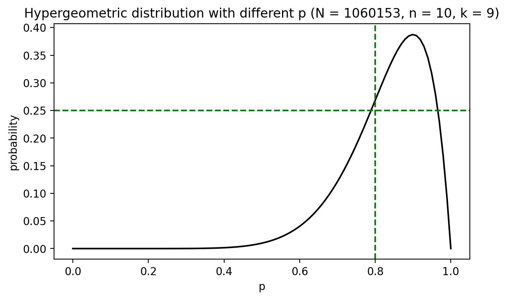


---

# We will only use English books

```sql
CREATE TABLE books2 AS
SELECT * FROM books
WHERE language_code = 'eng' OR language_code = 'en-US' OR language_code = 'en-GB'
```

---

# Unnesting

- notice `authors` in `books` dataset is a list of dictionaries
    - `[{'author_id': 99727, 'role': ''}]`
    - `[{'author_id': 1654, 'role': ''}, {'author_id': 8134289, 'role': ''}]`
- we need to use `UNNEST` to expand the list of dictionaries
- reference: <a href="https://duckdb.org/docs/sql/query_syntax/unnest.html" target="_blank"> UNNEST </a>


```sql
SELECT unnest([{'author_id': 1654, 'role': ''}, {'author_id': 8134289, 'role': ''}], recursive := true)
```


---

# Expand Table

```sql
SELECT book_id, title, authors, unnest(authors) AS author_info
FROM books2
USING SAMPLE 10
```

> The above query will expand the table based on the number of authors for each book

```bash
┌──────────┬────────────────────────────────────────────────────────────────────────────┬─────────────────────────────────────┐
│ book_id  │                                  authors                                   │             author_info             │
├──────────┼────────────────────────────────────────────────────────────────────────────┼─────────────────────────────────────┤
│ 10082852 │                    [{'author_id': 568912, 'role': ''}]                     │  {'author_id': 568912, 'role': ''}  │
│ 25777967 │ [{'author_id': 14123272, 'role': ''}, {'author_id': 14123273, 'role': ''}] │ {'author_id': 14123272, 'role': ''} │
│ 25777967 │ [{'author_id': 14123272, 'role': ''}, {'author_id': 14123273, 'role': ''}] │ {'author_id': 14123273, 'role': ''} │
│ 25528801 │                    [{'author_id': 7418796, 'role': ''}]                    │  {'author_id': 7418796, 'role': ''} │
│ 23213117 │                    [{'author_id': 7178855, 'role': ''}]                    │  {'author_id': 7178855, 'role': ''} │
│ 6972269  │                    [{'author_id': 414681, 'role': ''}]                     │  {'author_id': 414681, 'role': ''}  │
│ 29772860 │ [{'author_id': 5701450, 'role': ''}, {'author_id': 14987844, 'role': ''}]  │  {'author_id': 5701450, 'role': ''} │
│ 29772860 │ [{'author_id': 5701450, 'role': ''}, {'author_id': 14987844, 'role': ''}]  │ {'author_id': 14987844, 'role': ''} │
└──────────┴────────────────────────────────────────────────────────────────────────────┴─────────────────────────────────────┘
```

---

# Did not expect SQL to be so powerful :flushed:


```sql
SELECT *, author_info['author_id'] AS author_id
FROM (
    SELECT book_id,  authors, unnest(authors) AS author_info
    FROM books2
    USING SAMPLE 10  
)
``` 

```bash
┌──────────┬──────────────────────────────────────────────┬───────────┐
│ book_id  │                 author_info                  │ author_id │
├──────────┼──────────────────────────────────────────────┼───────────┤
│ 15156124 │      {'author_id': 2737333, 'role': ''}      │  2737333  │
│  638745  │       {'author_id': 19758, 'role': ''}       │   19758   │
│  638745  │ {'author_id': 310261, 'role': 'Contributor'} │   310261  │
│  638745  │ {'author_id': 9883658, 'role': 'Translator'} │  9883658  │
└──────────┴──────────────────────────────────────────────┴───────────┘
```

---

# Join Tables :clap:

```sql
-- # create a new table books3
-- # join books2 and authors
-- # by extracting author_id from author_info column
CREATE TABLE books3 AS
SELECT b.*, author_info['author_id'] AS author_id, a.name
FROM (
    SELECT *, unnest(authors) AS author_info
    FROM books2
) AS b
LEFT JOIN authors AS a ON b.author_info['author_id'] = a.author_id
-- # now we get 1,239, 751 rows
```


---

# Review dataset

- `11307715` (11.3m) reviews after filtering with `book_id` in `books3`

```sql
-- # create review table where book_id exists in books3
CREATE TABLE reviews AS
SELECT user_id, book_id, review_id, review_text, n_votes, n_comments
FROM read_json_auto('./data/goodreads_reviews_dedup.json.gz')
WHERE book_id IN (SELECT book_id FROM books3)
```

---

# Top 10 books with most reviews

```sql
SELECT b3.title, r.num_book_reviews, b3.average_rating, b3.book_id
FROM (
    SELECT book_id, COUNT(*) AS num_book_reviews
    FROM reviews
    GROUP BY book_id
    ORDER BY num_book_reviews DESC
    LIMIT 10
) AS r
LEFT JOIN books3 AS b3 ON r.book_id = b3.book_id
ORDER BY r.num_book_reviews DESC
```

---

# Top 10 books with most reviews

```
┌─────────────────────────────────────────┬──────────────────┬────────────────┬──────────┐
│                  title                  │ num_book_reviews │ average_rating │ book_id  │
├─────────────────────────────────────────┼──────────────────┼────────────────┼──────────┤
│          The Fault in Our Stars         │      20756       │      4.26      │ 11870085 │
│ The Hunger Games (The Hunger Games, #1) │      18617       │      4.34      │ 2767052  │
│    Mockingjay (The Hunger Games, #3)    │      13536       │      4.03      │ 7260188  │
│          The Girl on the Train          │      13402       │      3.88      │ 22557272 │
│   Catching Fire (The Hunger Games, #2)  │      11904       │      4.30      │ 6148028  │
│              The Book Thief             │      11300       │      4.36      │  19063   │
│ Fifty Shades of Grey (Fifty Shades, #1) │      11184       │      3.66      │ 10818853 │
│        Divergent (Divergent, #1)        │      10743       │      4.23      │ 13335037 │
│         Twilight (Twilight, #1)         │      10535       │      3.57      │  41865   │
│               The Martian               │       9590       │      4.39      │ 18007564 │
└─────────────────────────────────────────┴──────────────────┴────────────────┴──────────┘
```

---

# Distribution of reviews

```R
dbGetQuery(con,
          "SELECT book_id, COUNT(*) AS count
          FROM reviews
          GROUP BY book_id
          ORDER BY count DESC") %>%
    # plot the distribution of the number of reviews per book
    with(plot(count, ylab="Number of reviews per book",
              xlab="Index Number of the book",
              main="Distribution of the number of reviews per book",
              log='x'))
# log scale
```

---

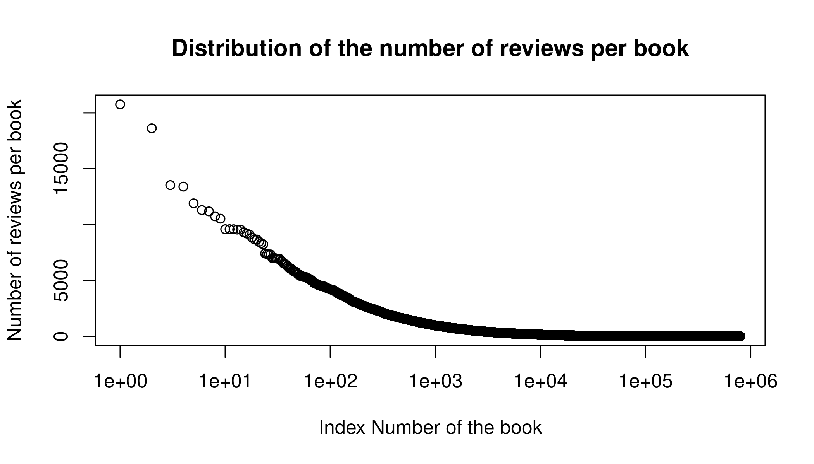


--- 

# Why I love R :heart: for data analysis

```R
# describe all tables
dbGetQuery(con, "SHOW TABLES;") %>%
    .$name %>%
    lapply(
        function(x) dbGetQuery(con, paste0("DESCRIBE ", x))
        ) %>%
    kable()
```

<br>

> It is so easy to describe all tables in R (but not in Python)


---

# Why I love R :heart: (I use both R and Python)

```R
dbGetQuery(con,
    "SELECT publication_year, COUNT(*) AS count
    FROM books3
    WHERE publication_year IS NOT NULL AND publication_year != ''
    GROUP BY publication_year
    ORDER BY count DESC") %>%
    as.data.table() %>%
    # convert the publication_year to numeric
    .[, .(year = as.numeric(publication_year), count)] %>%
    # only take the books published after 1990 and before 2023
    .[year > 1990 & year < 2023] %>%
    # order by year
    .[order(year)] %>% 
    # plot it with connected dot
    with(plot(year, count, type='b', xlab='Publication year',
              ylab='Number of books',
              main='Trend of the number of books published per year'))
```

---

# duckdb VIEW :duck:

- <a href="https://duckdb.org/docs/sql/statements/create_view.html" target="_blank"> CREATE VIEW </a>

- Views are virtual tables that are the result of a query. They are useful for simplifying complex queries and for hiding the complexity of the underlying data structure.

- But it will be materialized when you query it, especially:
    - `USING SAMPLE` (slow and takes a lot of memory)
    - `LIMIT 10` is better for having a quick look at the data


---

# Data for embedding


```
|column_name |column_type |null |key |default | extra|
|:-----------|:-----------|:----|:---|:-------|-----:|
|book_id     |BIGINT      |YES  |NA  |NA      |    NA|
|title       |VARCHAR     |YES  |NA  |NA      |    NA|
|description |VARCHAR     |YES  |NA  |NA      |    NA|
|review_id   |UUID        |YES  |NA  |NA      |    NA|
|review_text |VARCHAR     |YES  |NA  |NA      |    NA|
```


---

# Data for embedding


```
{
    "book_id":12047169,
    "title": "Chocolate Covered Murder (A Lucy Stone Mystery, #18)",
    "description":"Lucy Stone, mother of three, works as
    a reporter on her local paper in the small . . .
    "review_id":"597149f4-5e89-5ef0-c7bf-9cecb161fff3",
    "review_text":"This got two stars because . . . 
}
```

---

# Some SQL

```sql
SELECT *
    FROM books_reviews
    WHERE book_id IN (
        SELECT book_id
        FROM (
            SELECT book_id, COUNT(*) AS count
            FROM books_reviews
            GROUP BY book_id
            HAVING count > 1000
            ORDER BY count ASC
            LIMIT 5
            )
        );
```

---

# Same Table in R

```R
dbGetQuery(con,
    "SELECT book_id, COUNT(*) AS count
    FROM books_reviews
    GROUP BY book_id
    HAVING count > 1000
    ORDER BY count DESC") %>%  # this get a table
    as.data.table() %>%
    # sample 5 rows
    .[sample(.N, 5)] %>%  # now we sample
    # map the book_id to dbGetQuery
    .[, dbGetQuery(con, "SELECT *
                        FROM books_reviews
                        WHERE book_id IN (?, ?, ?, ?, ?)",
                        book_id)] %>%
    # it return as data.frame, so we need to convert it to data.table
    as.data.table()
```


---

```
| book_id|title                                           |review_id                            |
|-------:|:-----------------------------------------------|:------------------------------------|
| 8755776|City of Lost Souls (The Mortal Instruments, #5) |a6559c80-68e1-149b-e2b7-4822d4355d39 |
| 8755776|City of Lost Souls (The Mortal Instruments, #5) |c1c72135-ae23-7dcd-3a55-96e33852e5a9 |
|   38980|The Princess Diaries (The Princess Diaries, #1) |962b4066-0fe6-a561-c6fb-c78ff4cffd39 |
|   38980|The Princess Diaries (The Princess Diaries, #1) |962b4066-0fe6-a561-c6fb-c78ff4cffd39 |
|   38980|The Princess Diaries (The Princess Diaries, #1) |962b4066-0fe6-a561-c6fb-c78ff4cffd39 |
```


---

# Wrap up

- Starting point of using `duckdb`

```
# in R
con <- dbConnect(duckdb())  # in memory
con <- dbConnect(duckdb(), dbdir = "goodreads.db")  # construct a database in the disk
# in Python
conn = duckdb.connect()  # in memory
conn = duckdb.connect('goodreads.db')  # construct a database in the disk
```

- The results will be:
    - erased when you close the connection if you use `:memory:`
    - saved in the disk if you use `dbdir = "goodreads.db"`


---

- Two tools to recommend:
    - JupySQL
    - it allows you to use SQL in Jupyter Notebook
    ```
    %%sql
    -- # read and describe books data
    DESCRIBE
    SELECT * FROM read_json_auto('data/goodreads_books.json.gz')
    ```

- R `DBI` package
    - it allows you to use SQL in R
    ```
    dbGetQuery(con, "SELECT * FROM books LIMIT 10")
    ```

- Use R if you want to do plotting, otherwise JuptySQL is enough

---

# A good workshop about DuckDB and Arrow

<a href="https://arrow-user2022.netlify.app/" target="_blank"> Arrow and DuckDB </a>